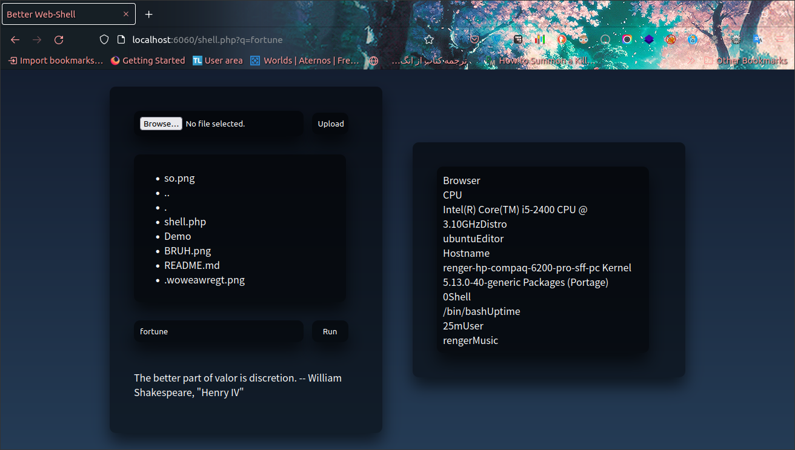
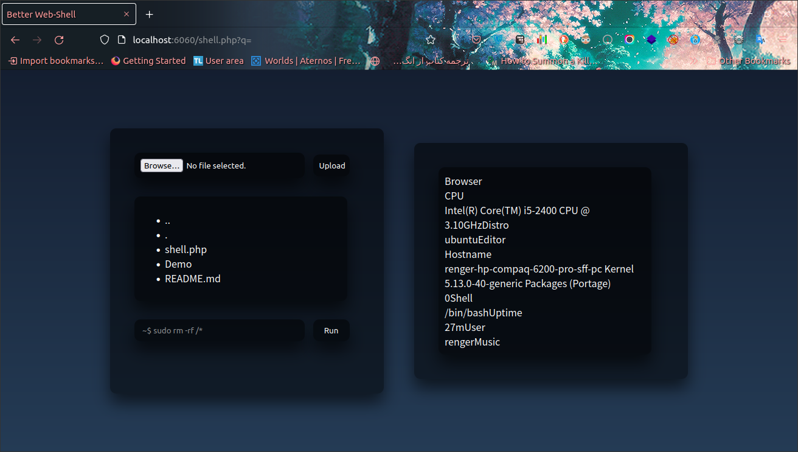

# Simple-WebShell
This is a better webshell with php<br>
You can run system commands and upload files to the server<br>
hope you like it <3


# Test
How to test it?<br>
Go to the shell folder and run php localhost:
```
cd Simple-WebShell
php -S localhost:6060
```
then open the following url
```
http://localhost:6060/shell.php
```
now click on Browse button and choose the file u want to upload. then click on Upload button next to it and upload ur file!<br>
You can run system commands on it too like the last shell on my github:
```
https://github.com/FireKing255/Simple-WebShell
```
it can show u server infromation too

# Developer
coded by FireKing255<br>
instagram: https://instagram.com/fireking255.hack<br>
github: https://github.com/fireking255<br>
website: https://fireking255.github.io/

# Demo


