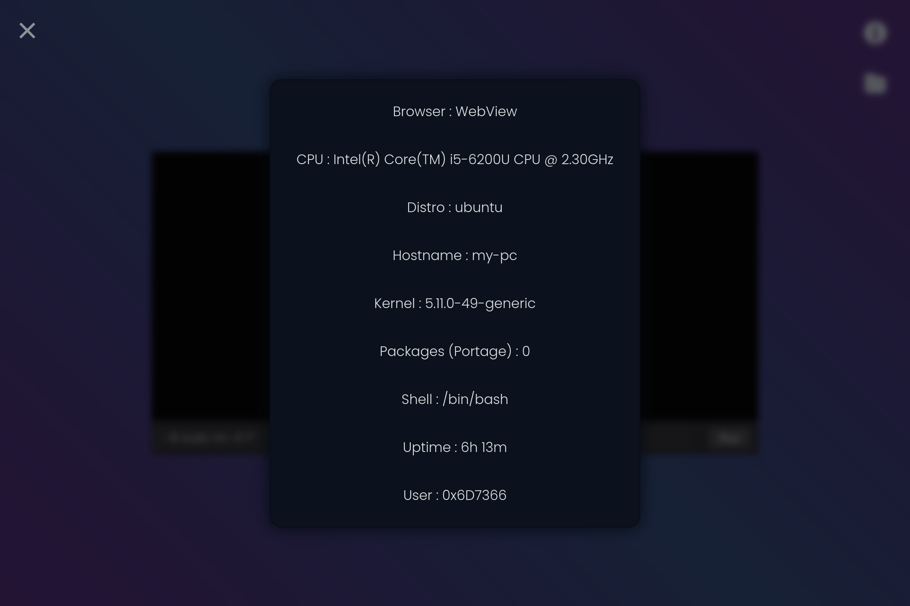

# Better-WebShell

This is a better webshell with php

You can run system commands and upload files to the server<br>
hope you like it :)

<br>

## Test

How to test it?<br>
Go to the shell folder and run php localhost:
```
php -S localhost:6060 -t Better-WebShell
```

then open the following url
```
http://localhost:6060/shell.php
```

now click on Browse button and choose the file u want to upload. then click on Upload button next to it and upload ur file!

You can run system commands on it too like the last shell on my github:

```
https://github.com/PrincessOfMeowTown/Better-WebShell
```

it can show u server infromation too

<br>

## Demo





<br>

## Developers

 coded by [PrincessOfMeowTown](https://github.com/PrincessOfMeowTown)

 rewrite by [0x6D7366](https://github.com/0x6D7366)